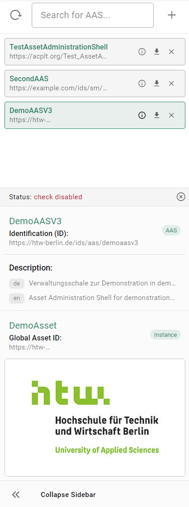
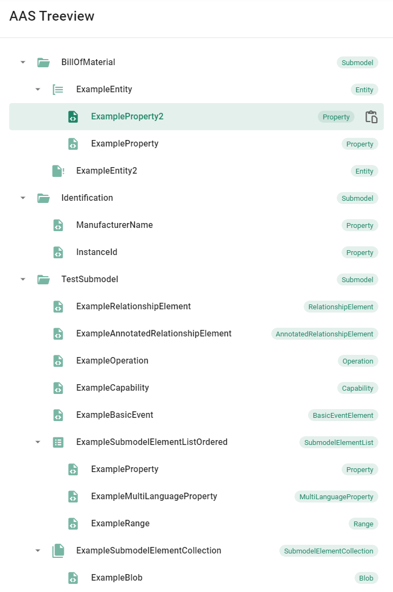
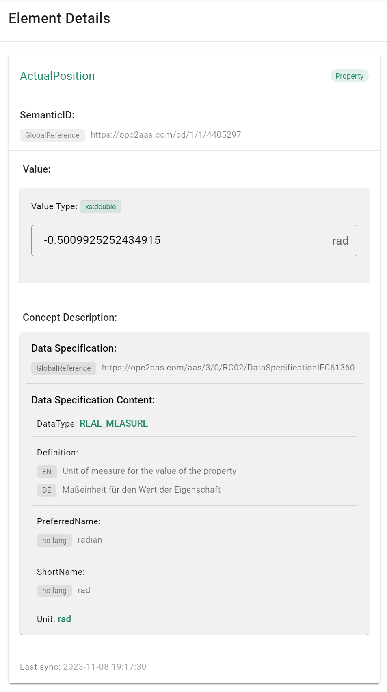

# AAS Web UI

The AAS Web UI is a vue.js 3 based web application and can be used to visualize and interact with Asset Administration Shells. It is intended to work in conjunction with the BaSyx Registry and the BaSyx AAS Environment.

```{figure} ./images/aas_web_ui.png
---
width: 100%
alt: AAS Web UI
name: web_ui
---
```

## Download

```{note}
:class: margin
The AAS Web UI is now only compatible with the components of BaSyx V2 and the Asset Administration Shell V3.
```

The AAS Web UI can be downloaded from [Docker Hub](https://hub.docker.com/r/eclipsebasyx/aas-gui) as off-the-shelf component.
Yuo can pull it by executing the following command:

```bash
docker pull eclipsebasyx/aas-gui
```

## Quick Start

```{note}
:class: margin
Docker must be installed on your system to run the AAS Web UI.

Dockers official documentation provides a [detailed installation guide](https://docs.docker.com/get-docker/) for Windows, Mac and Linux.
```

The container for the AAS Web UI can be started by executing the following command:

```bash
docker run -p 3000:3000 --name=aas-web-ui eclipsebasyx/aas-gui
```

When the container is running, you can access the AAS Web UI by navigating to [http://localhost:3000](http://localhost:3000) in your browser.

There you will be able to connect to the BaSyx Registry and the AAS Environment (AAS Repository, Submodel Repository, Concept Description Repository) from the main menu.

```{figure} ./images/connect_to_basyx.png
---
width: 80%
alt: Connect to BaSyx Components
name: connect_basyx
---
```

## Introductory Example

You can find a complete example on how to setup a BaSyx environment with the AAS Web UI, Registry and AAS Environment in the [Quick Start](../../../introduction/quickstart) section.

## Interacting with AAS

### AAS List Sidebar

````{sidebar}

````

The AAS List shows all Asset Administration Shells that are registered. The list can be filtered by entering a search term in the search bar.

There is also an option to show an information window for each Asset Administration Shell by clicking on the info icon. The information window shows the AAS ID, the AAS Name, the AAS Description and information regarding the asset like the global asset ID and a thumbnail.

In addition, the AAS can be removed from the registry by clicking on the **delete/close** icon. Clicking the **download** icon will download the AAS as an AASX file.

### AAS Treeview

````{sidebar}

````

The AAS Treeview shows the Asset Administration Shell in a tree structure. The tree can be expanded by clicking on the expand icon on the left side of each Submodel/SubmodelElementCollection. Clicking directly on a Submodel/SubmodelElement will show the Submodel/SubmodelElement in the Element Details Page further to the right.

If a SubmodelElement is selected you are able to copy its path to the clipboard by clicking on the **copy** icon on the right side of the SubmodelElement.

### Element Details

````{sidebar}

````

The Element Details Page shows the content of the selected SubmodelElement. This includes the following information:

- idShort
- modelType
- semanticId
- description
- value
- dataSpecificationContent (fetched from the Concept Description Repository)

```{note}
:class: margin
The Capability and Event SubmodelElement types are not yet implemented.
```

The implemented SubmodelElements follow the specification for the AAS in Metamodel Version 3. Currently, the following SubmodelElements have their own visualization:

- SubmodelElementCollection
- SubmodelElementList
- Property
- MultiLanguageProperty
- File
- Blob
- Operation
- ReferenceElement
- Range
- Entity
- RelationshipElement
- AnnotatedRelationshipElement

## Features

```{toctree}
:caption: Features
:maxdepth: 1

features/statuscheck
```